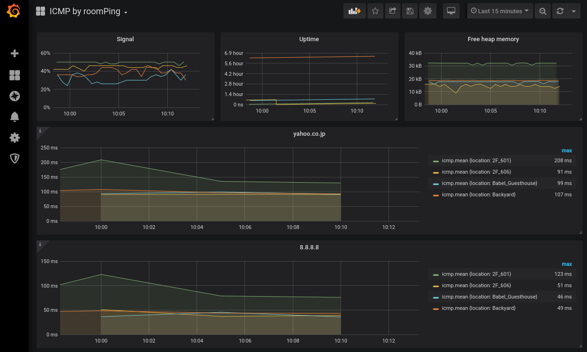

# `roomPing`

[](https://travis-ci.com/trombik/roomPing)

`ICMP` _sensor_ on `ESP32` and `ESP8266` . The device periodically sends and
receives `ICMP` packets to/from destinations. The result in `influx` line
protocol format is published to `MQTT` broker. This is a project based on
`esp-idf` SDK.

## Features

* Periodically `ping` defined targets, publish results via MQTT
* Support Homie 4.x
* Publishes `RSSI`, uptime, free heap memory, under node `esp` (see
  [`trombik/esp-homie`](https://github.com/trombik/esp-homie))

## Use cases

You would like to know quality of WiFi at several rooms to improve the
quality, and to see the trends of the qualities for diagnostics and/or
improvements.

## NOT-BUGS

The device is assumed to be powered by AC main. Thus, `deep-sleep` will not be
implemented. Unlike temperature sensors, the longest interval is likely to be
five minutes, usually one or two minutes. At this frequency, `deep-sleep` will
not save much, if not at all.

## Required hardware

Any of `ESP32` or `ESP8266` development boards.

## Hardware notes

### ESP8266

The latest `esp-mqtt` is used instead of the bundled `mqtt`. Define
`PROJECT_TARGET="esp8266"` to build the application with `esp-mqtt`.

```console
make all PROJECT_TARGET="esp8266"
```

On ESP8266, the application _generally_ works, but it occasionally crashes
when built with `mqtt`.

### `ESP-01` and its variants

`ESP-01` is not very user friendly. If you are not familiar with it, you
should start with a generic `ESP8266` development board, such as `NodeMCU`
and its clones.

Power is critically important. Make sure 3.3V is stable and stiff enough. This
is especially true when the device needs full WiFi calibration.

Pin configuration is:

- VCC -> 3.3V
- GND -> GND
- GPIO 0 -> GND when uploading, floating (unconnected) when running
- GPIO 2 -> floating (unconnected)
- RST -> pull up to VCC through 10K register
- CHPD -> pull up to VCC through 10K register
- RXD -> TX of serial converter
- TXD -> RX of serial converter

`ESP-01` and its variants, including `ESP-05`, `ESP-12`, need additional
non-default `sdkconfig` options. Use `make menuconfig` to change them.

Make sure to set correct flash size. `Serial flasher config` -> `Flash size`.
Usually, it's 1 MB, but not always.

Make sure to set correct `Flash SPI mode`. `Serial flasher config` -> `Flash
SPI mode`. Usually, it's either `DIO` or `DOUT`, but not always.

Make sure to set `Partition Table` to `Single factory app, no OTA`. `Partition
Table` -> `Partition Table`.

In addition to all ESP8266 specific options, you need something like the
following in `sdkconfig`.

```make
CONFIG_ESPTOOLPY_FLASHSIZE="1MB"
CONFIG_ESPTOOLPY_FLASHMODE_DOUT=y
CONFIG_PARTITION_TABLE_SINGLE_APP=y
```

Typical log when you CAN upload the application but `ESP-01` refuses to work
looks like below:

```console
 ets Jan  8 2013,rst cause:2, boot mode:(3,7)

load 0x40100000, len 7572, room 16
tail 4
chksum 0xef
load 0x00000000, len 0, room 4
tail 0
chksum 0xef
ho 12 tail 0 room 4
load 0x00000000, len 0, room 12
tail 0
chksum 0xef
csum 0xef
csum err
ets_main.c ~
```

## Required software

To achieve the goal of the use case, you need:

* `esp-idf` and its tool-chains
* An `ESP32` or `ESP8266` device
* An `MQTT` broker ([mosquitto](https://mosquitto.org/))
* An `MQTT` subscriber with influx line protocol support
  ([telegraf](https://github.com/influxdata/telegraf)) and/or my
  [`trombik/mqtt-influxdb-translator`](https://github.com/trombik/mqtt-influxdb-translator).
* A time series database ([influxdb](https://www.influxdata.com/))
* A metric visualizer ([grafana](https://grafana.com/))

Note that `telegraf` does support MQTT natively, it does NOT support
translating MQTT values to `influxdb` line protocol format.

## Screenshots



## Tested builds

This project requires [ICMP Echo](https://docs.espressif.com/projects/esp-idf/en/latest/api-reference/protocols/icmp_echo.html)
support in `esp-idf`. As of this writing, only `4.x` branch, or `master`,
supports it.

| `esp-idf` version | hardware  |
|-------------------|-----------|
| master branch     | `WROOM32` |
| master branch (ESP8266 RTOS SDK)    | any ESP8266 |

## Project configuration

`make menuconfig` has `Project configuration` menu to modify default
configuration.

See a list of configurations at
[src/main/Kconfig.projbuild](src/main/Kconfig.projbuild).

### Targets

A list of targets is defined in [`src/main/target.h.dist`](src/main/target.h.dist).

## Building the project

### Creating `target.h`

`target.h` is a header file to define a list of `ICMP` destinations.

```
> pwd
/home/trombik/github/trombik/roomPing/src
> cp main/target.h.dist main/target.h
```

You may modify `targets` in `main/target.h`. `N_TARGETS` must be the length of
`targets`.

### Copying certificates (optional)

Both `OTA` and `MQTT` supports TLS.

Path to the certificate for `OTA` is `main/certs/ota/ota.pem`.

```
> pwd
/home/trombik/github/trombik/roomPing/src
> cp path/to/your/public/ota_certificate.pem main/certs/ota/ota.pem
```

Path to the certificate for `MQTT` is `main/certs/mqtt/mqtt.pem`.

```
> pwd
/home/trombik/github/trombik/roomPing/src
> cp path/to/your/public/mqtt_certificate.pem main/certs/mqtt/mqtt.pem
```

Note that you also need to set `CONFIG_PROJECT_TLS_*` in `menuconfig`.

### Configuring the project

Project configurations can be modified by `idf.py menuconfig`.

```
> $IDF_PATH/tools/idf.py menuconfig
```

### Building everything

Finally, the build.

```
> $IDF_PATH/tools/idf.py build
```

## Known issues

The project uses `esp32-homie`. [All the limitations of
it](https://github.com/trombik/esp32-homie#known-bugs)  applies.

## Example log outputs

An example of console outputs:

```
I (0) cpu_start: Starting scheduler on APP CPU.
I (578) app_main: SHA-256 for the partition table: : d1c0e9d02fa9d26cd2e1984e7b5dd20157204f501ddc83ce82229e5f3175ee8b
I (608) app_main: SHA-256 for bootloader: : 81a6c54a8cfd05f7cf69b8748d44a8e4693af1974d32903251a13cc300ff7d54
I (898) app_main: SHA-256 for current firmware: : 0000000000000000000000000000000000000000000000000000000000000000
W (898) app_main: esp_ota_get_state_partition() failed: ESP_ERR_NOT_SUPPORTED
I (908) app_main: Initializing NVS
I (938) app_main: Configuring WiFi
I (938) wifi_connect: Connecting to SSID: `MYSSID`
I (958) wifi: wifi driver task: 3ffc1828, prio:23, stack:3584, core=0
I (958) system_api: Base MAC address is not set, read default base MAC address from BLK0 of EFUSE
I (958) system_api: Base MAC address is not set, read default base MAC address from BLK0 of EFUSE
I (988) wifi: wifi firmware version: a44d1c6
I (988) wifi: config NVS flash: enabled
I (988) wifi: config nano formating: disabled
I (988) wifi: Init dynamic tx buffer num: 32
I (988) wifi: Init data frame dynamic rx buffer num: 32
I (998) wifi: Init management frame dynamic rx buffer num: 32
I (998) wifi: Init management short buffer num: 32
I (1008) wifi: Init static rx buffer size: 1600
I (1008) wifi: Init static rx buffer num: 10
I (1018) wifi: Init dynamic rx buffer num: 32
W (1018) event: handler already registered, overwriting
I (1118) phy: phy_version: 4180, cb3948e, Sep 12 2019, 16:39:13, 0, 0
I (1118) wifi: mode : sta (xx:xx:xx:xx:xx:xx)
I (1118) app_main: Configured WiFi. Waiting for WIFI_CONNECTED_BIT...
I (1248) wifi: new:<11,0>, old:<1,0>, ap:<255,255>, sta:<11,0>, prof:1
I (1248) wifi: state: init -> auth (b0)
I (1258) wifi: state: auth -> assoc (0)
I (1268) wifi: state: assoc -> run (10)
I (1288) wifi: connected with MYSSID, aid = 5, channel 11, BW20, bssid = xx:xx:xx:xx:xx:xx, security type: 3, phy: bgn, rssi: -49
I (1298) wifi: pm start, type: 1

I (1318) wifi: AP's beacon interval = 102400 us, DTIM period = 1
I (1938) esp_netif_handlers: sta ip: 192.168.1.31, mask: 255.255.255.0, gw: 192.168.1.1
I (1938) wifi_connect: Connected to the AP
I (1938) app_main: Configuring time
I (1948) app_main: Current time: 2019-12-15T03:12:14Z
I (1948) app_main: Configured time
I (1958) app_main: Creating queue for metrics
I (1958) app_main: Creating task_publish
MAC address: xx:xx:xx:xx:xx:xx
I (1968) task_publish: Creating mqtt_event_group
I (1968) task_publish: Wating for WIFI_CONNECTED_BIT
I (1978) task_publish: running homie_init()
I (1978) task_publish: running homie_run()
I (1988) HOMIE: MQTT URI: `mqtt://192.168.1.63:1883`
I (1988) HOMIE: MQTT topic: `homie/foo/#`
I (1998) HOMIE: Reboot enabled: true
I (1998) HOMIE: OTA enabled: true
I (2008) HOMIE: OTA firmware URL: `https://192.168.1.54:8070/build/roomPing.bin`
I (2018) HOMIE: Running esp_mqtt_client_start()
I (2018) HOMIE: Starting homie_task
I (2018) HOMIE: MQTT_EVENT_BEFORE_CONNECT
I (2038) task_publish: Creating task_publish()
I (2038) task_publish: started task_mqtt_client
I (2038) task_publish: Starting the loop
I (2038) app_main: Creating task_icmp_client
I (2048) 8.8.8.8: Configuring ping client with target `8.8.8.8`
I (2048) yahoo.co.jp: Configuring ping client with target `yahoo.co.jp`
I (2058) 8.8.8.8: Creating new ICMP session
I (2048) 192.168.1.1: Configuring ping client with target `192.168.1.1`
I (2068) 8.8.8.8: Starting the loop
I (2078) 8.8.8.8: Starting ICMP seesion
I (2078) 192.168.1.1: Creating new ICMP session
I (2078) yahoo.co.jp: Creating new ICMP session
I (2088) 192.168.1.1: Starting the loop
I (2098) 192.168.1.1: Starting ICMP seesion
I (2098) yahoo.co.jp: Starting the loop
I (2108) yahoo.co.jp: Starting ICMP seesion
I (2148) MQTT_CLIENT: Sending MQTT CONNECT message, type: 1, id: 0000
I (2168) HOMIE: MQTT_EVENT_CONNECTED
I (2168) HOMIE: Starting the loop in homie_task()
I (2268) HOMIE: successfully subscribed to topic: `homie/foo/esp/reboot/set` msg_id=41910
I (2278) HOMIE: successfully subscribed to topic: `homie/foo/esp/ota/set` msg_id=33343
I (2298) HOMIE: device status has been updated
I (2398) HOMIE: MQTT_EVENT_SUBSCRIBED, msg_id=41910
I (2398) HOMIE: MQTT_EVENT_SUBSCRIBED, msg_id=33343
8.8.8.8: 15 packets transmitted, 15 received, 0% packet loss, average 53ms
183.79.135.206: 15 packets transmitted, 15 received, 0% packet loss, average 170ms
192.168.1.1: 15 packets transmitted, 15 received, 0% packet loss, average 1ms
icmp,target_host=8.8.8.8,target_addr=8.8.8.8 packet_loss=0 1576379535000000000
icmp,target_host=8.8.8.8,target_addr=8.8.8.8 average=53 1576379535000000000
icmp,target_host=yahoo.co.jp,target_addr=183.79.135.206 packet_loss=0 1576379535000000000
icmp,target_host=yahoo.co.jp,target_addr=183.79.135.206 average=170 1576379535000000000
icmp,target_host=192.168.1.1,target_addr=192.168.1.1 packet_loss=0 1576379535000000000
icmp,target_host=192.168.1.1,target_addr=192.168.1.1 average=1 1576379535000000000
```

An example of published `MQTT` messages:

```
homie/foo/$state init
homie/foo/$homie 4.0.1
homie/foo/$name mydevice
homie/foo/$nodes esp
homie/foo/esp/$name ESP32
homie/foo/esp/$type rev: 0
homie/foo/esp/$properties uptime,rssi,signal,freeheap,mac,ip,sdk,firmware,firmware-version,ota,reboot
homie/foo/esp/uptime/$name Uptime since boot
homie/foo/esp/uptime/$datatype integer
homie/foo/esp/rssi/$name WiFi RSSI
homie/foo/esp/rssi/$datatype integer
homie/foo/esp/signal/$name WiFi RSSI in signal strength
homie/foo/esp/signal/$datatype integer
homie/foo/esp/freeheap/$name Free heap memory
homie/foo/esp/freeheap/$datatype integer
homie/foo/esp/mac/$name MAC address
homie/foo/esp/mac/$datatype string
homie/foo/esp/mac xx:xx:xx:xx:xx:xx
homie/foo/esp/ip/$name IP address
homie/foo/esp/ip/$datatype string
homie/foo/esp/ip 192.168.1.31
homie/foo/esp/sdk/$name SDK version
homie/foo/esp/sdk/$datatype string
homie/foo/esp/sdk v4.1-dev-1088-gb258fc376
homie/foo/esp/firmware/$name Firmware name
homie/foo/esp/firmware/$datatype string
homie/foo/esp/firmware myname
homie/foo/esp/firmware-version/$name Firmware version
homie/foo/esp/firmware-version/$datatype string
homie/foo/esp/firmware-version 1
homie/foo/esp/ota/$name OTA state
homie/foo/esp/ota/$datatype enum
homie/foo/esp/ota/$settable true
homie/foo/esp/ota/$retained false
homie/foo/esp/ota/$format idle,disabled,running,run
homie/foo/esp/ota idle
homie/foo/esp/reboot/$name Reboot state
homie/foo/esp/reboot/$datatype enum
homie/foo/esp/reboot/$settable true
homie/foo/esp/reboot/$retained false
homie/foo/esp/reboot/$format disabled,enabled,rebooting,reboot
homie/foo/esp/reboot enabled
homie/foo/esp/reboot/set (null)
homie/foo/esp/ota/set (null)
homie/foo/$state ready
homie/foo/icmp/$name ICMP statics
homie/foo/icmp/$properties influx
homie/foo/icmp/influx/$name statistics in influx line format
homie/foo/icmp/influx/$datatype string
homie/foo/esp/uptime 1
homie/foo/esp/rssi -52
homie/foo/esp/signal 96
homie/foo/esp/freeheap 157776
homie/foo/icmp/influx icmp,target_host=8.8.8.8,target_addr=8.8.8.8 packet_loss=0 1576379418000000000
homie/foo/icmp/influx icmp,target_host=8.8.8.8,target_addr=8.8.8.8 average=74 1576379418000000000
homie/foo/icmp/influx icmp,target_host=192.168.1.1,target_addr=192.168.1.1 packet_loss=0 1576379418000000000
homie/foo/icmp/influx icmp,target_host=192.168.1.1,target_addr=192.168.1.1 average=1 1576379418000000000
homie/foo/icmp/influx icmp,target_host=yahoo.co.jp,target_addr=182.22.59.229 packet_loss=0 1576379418000000000
homie/foo/icmp/influx icmp,target_host=yahoo.co.jp,target_addr=182.22.59.229 average=195 1576379418000000000
```
